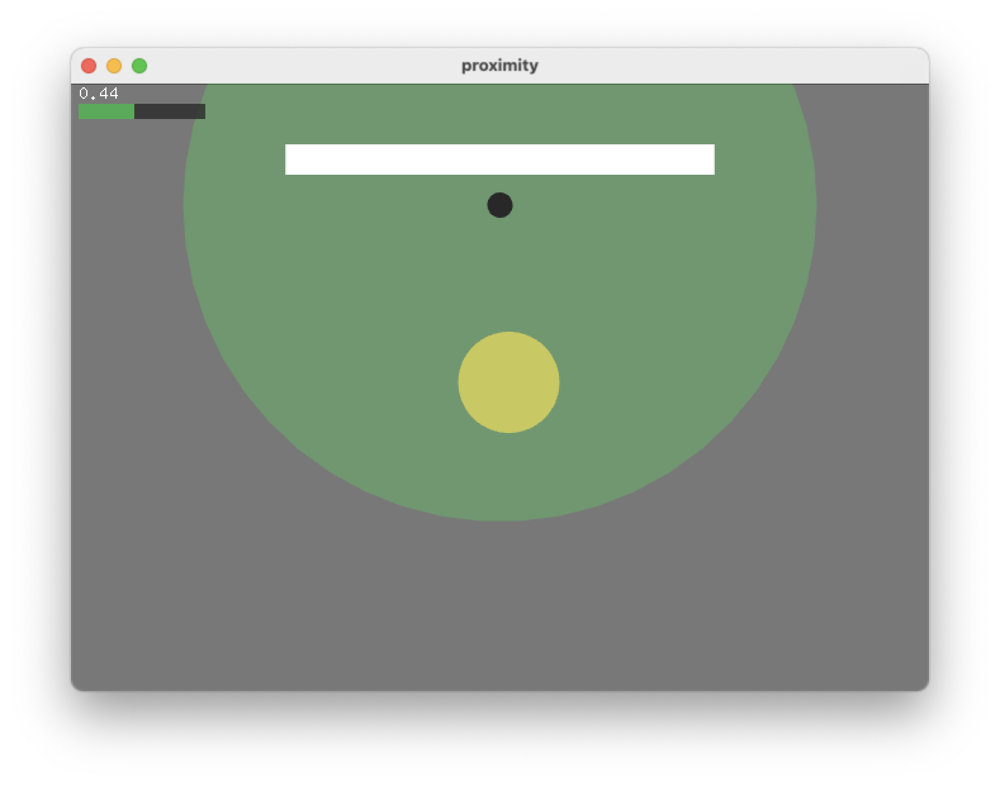

AI-assisted Museum Label
========================

Auto-adaptive, AI-supported museum label with language identification

This code base has been developed by [ZKM | Hertz-Lab](https://zkm.de/en/about-the-zkm/organization/hertz-lab) as part of the project [»The Intelligent Museum«](#the-intelligent-museum). 

Please raise issues, ask questions, throw in ideas or submit code, as this repository is intended to be an open platform to collaboratively improve language identification.

Copyright (c) 2021 ZKM | Karlsruhe.  
Copyright (c) 2021 Paul Bethge.  
Copyright (c) 2021 Dan Wilcox.  

BSD Simplified License.

Overview
--------

Basic interaction:

1. Visitor walks up to installation & stands in front of text label
2. Text label prompts visitor to speak in their native language
3. Visitor speaks and text label listens
4. Installation shows which language it heard and adjusts digital info displays
5. Repeat steps 3 & 4

Components:

* Server
  - controller: installation logic controller OSC server
  - LanguageIdentifier: live audio language identifier
  - baton: OSC to websocket relay server
  - webserver.py: basic http file server
* Display
  - web clients: digital info display, interaction prompt, etc
  - tfluna: sensor read script which sends events over OSC

Communication overview:

~~~
LanguageIdentifier <-OSC-> controller -OSC-> baton -websocket-> web clients
tfluna --------------OSC-------^
proximity -----------OSC-------^
~~~

See also [system diagram PDF](media/system%20diagram.pdf)

Quick Start
-----------

Quick startup for testing on a single system

Setup:
1. Clone this repo and submodules
~~~
git clone git@git.zkm.de:Hertz-Lab/Research/intelligent-museum/museum-label.git
cd museum-label
git submodule update --init --recursive
~~~
2. Build LanguageIdentifier, see `LanguageIdentifier/README.md`
3. Install python dependencies:
~~~
cd ../museum-label
make
~~~

Run:
1. Start server:
~~~
./server.sh
~~~
2. On a second commandline, start display:
~~~
./display
~~~

### TF-Luna Sensor

If the TF-Luna sensor and USB serial port adapter are available, the display component will try to find the serial device path. If this simple detection doesn't work, you can provide the path as a display script argument:

    ./display.sh /dev/tty.usbserial-401

See `tfluna/README.md` for additional details.

### Proximity Simulator

If the TF-Luna sensor is not available, the system can be given simulated sensor events.

The proximity loaf sketch is a proximity sensor simulator which sends proximity sensor values (normalized 0-1) to the controller server. 

1. Download and install [loaf](http://danomatika.com/code/loaf)
2. Start loaf.app and drag `proximity/main.lua` onto the loaf window

If the server is running, drag the virtual visitor towards the artwork to initiate the detection process.

Dependencies
------------

General dependency overview:

* Python 3 & various libraries
* openFrameworks
* ofxTensorFlow2

See the README.md file for each the individual components subdirectory for details.

Server
------

The server component runs language identification from audio input, the logic controller, and web components.

### Setup

1. Python dependencies (easy)
2. LanguageIdentifier (involved)

_The default system is currently macOS but should work in Linux as well._

See `SETUP_MAC.md` for details on setting up macOS on a Mac mini to run Apache as the webserver for production environments.

#### Python

Install the server Python dependencies, run:

     make server

#### LanguageIdentifier

Next, build the LanguageIdentifier application. The system will need a compiler chain, openFrameworks, and ofxTensorFlow2 installed and additional steps may be needed based on the platform, such as generating the required project files.

See `LanguageIdentifier/README.md` for additional details.

Once ready, build via Makefile:

    cd LanguageIdentifier
    make ReleaseTF2
    make RunRelease

This should result in a LanguageIdentifier binary or .app in the `LanguageIdentifier/bin` subdirectory which can be invoked through the `LanguageIdentifier/langid` wrapper script. See `./LanguageIdentifier/langid --help` for help option info.

### Usage

Start the server with default settings via:

    ./server.sh

To stop, quit the LanguageIdentifier application or the script and the script will then kill it's subservices before exiting.

To print available options, use the `--help` flag:

    ./server.sh --help

#### Webserver

By default, the server script starts a local Python webserver on port 8080. The various clients can be reached in a browser on port 8080 using `http://HOST:8080/museum-label/NAME`. To open demo1, for example: `http://192.168.1.100:8080/museum-label/demo1`.

If the clients are being served via a webserver installed on the system, such as Apache httpd, run the server script *without* the Python webserver:

    ./server.sh --no-webserver

The webserver root should route `/museum-label` to the `html` directory.

_Running Apache is suggested for production environments._

Display
-------

The display component runs the proximity sensor and acts as the front end for the museum label.

### Setup

1. Python dependencies (easy)
2. TF-Luna hardware (medium)

_The default system is a Raspberry Pi but the display can also be run on macOS with the TF-Luna sensor connected via a USB serial port adapter._

See `SETUP_RPI.md` for details on setting up a Raspberry Pi to run the display component.

#### Python

Install the display Python dependencies, run:

     make display

### Usage

Start the display with default settings via:

    ./display.sh

To provide the sensor device path as the first argument:

    ./display.sh /dev/ttyAMA0

If the server component runs on a different system, provide the host address:

    ./display.sh --host 192.168.1.100

To stop, quit the script and it will then kill it's subservices before exiting.

To print available options, use the `--help` flag:

    ./display.sh --help

If the sensor is unavailable, the script will run a loop until it is exited.

#### Web Clients

Available html front-end clients are located in the `html` directory:

* demo0: very basic detected language display
* demo1: displays a greeting in the detected language
* demo2: displays example museum label text in the detected language
* prompt: interaction logic prompt, ie. "Please speak in your native language."
* textlabel: integrated prompt and museum label (current prototype)

The Intelligent Museum
----------------------

An artistic-curatorial field of experimentation for deep learning and visitor participation

The [ZKM | Center for Art and Media](https://zkm.de/en) and the [Deutsches Museum Nuremberg](https://www.deutsches-museum.de/en/nuernberg/information/) cooperate with the goal of implementing an AI-supported exhibition. Together with researchers and international artists, new AI-based works of art will be realized during the next four years (2020-2023).  They will be embedded in the AI-supported exhibition in both houses. The Project „The Intelligent Museum” is funded by the Digital Culture Programme of the [Kulturstiftung des Bundes](https://www.kulturstiftung-des-bundes.de/en) (German Federal Cultural Foundation) and funded by the [Beauftragte der Bundesregierung für Kultur und Medien](https://www.bundesregierung.de/breg-de/bundesregierung/staatsministerin-fuer-kultur-und-medien) (Federal Government Commissioner for Culture and the Media).

As part of the project, digital curating will be critically examined using various approaches of digital art. Experimenting with new digital aesthetics and forms of expression enables new museum experiences and thus new ways of museum communication and visitor participation. The museum is transformed to a place of experience and critical exchange.

