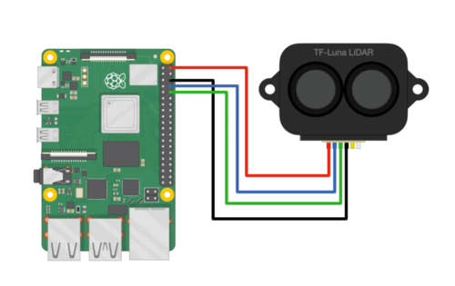

# Hardware/Serial ports (RX/TX pins)  
Raspberry Pi 3 <-> TFmini  

+5V <-> 5V(RED)  
GND <-> GND(BLACK)  
TXD0 <-> RX(WHITE)  
RXD0 <-> TX(GREEN)


  
Use `pinout` on the raspberry to see pinout 

### Installation and service start
```shell
./configPi.sh
./install.sh
reboot
```

### Removing the service
```shell
./remove_service.sh
```

### Testing

#### Using OSC 
Start the client as follows
```shell
python3 mini.py --port 8080 --destination 10.10.0.123 --epsilon 0.002 --interval 0.1 --max_distance 800
```

#### Using UDP
Start the client as follows
```shell
python3 mini.py --use_udp --port 54322 --destination 127.0.0.1 --epsilon 0.002 --interval 0.1 --max_distance 800
```

Start the test server
```shell
python3 tests/receive.py
```

#### TODOs
- unify OSC and UDP
- add OSC endpoint as a parameter
- ask for parameters during install script (currently using default values)